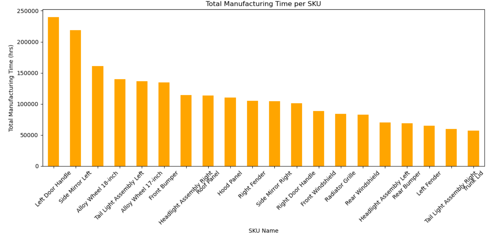
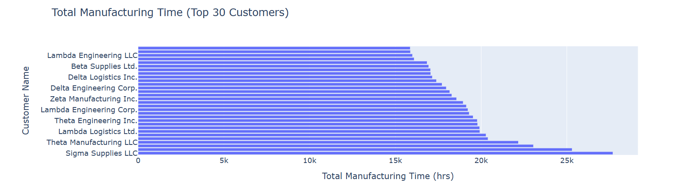
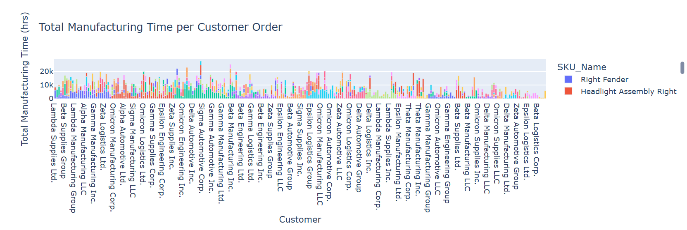
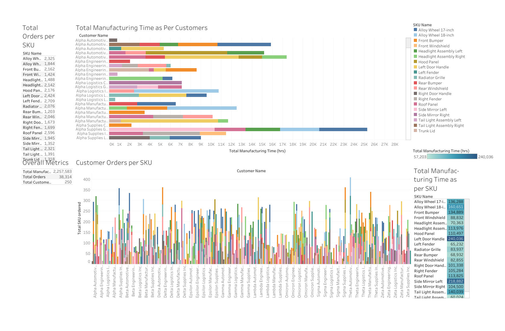

# 📦 Supply Chain Management

This project simulates a multi-client automotive parts supply chain by modeling customer orders, calculating manufacturing requirements based on SKU-level BOMs, and visualizing KPIs through a Tableau dashboard. It includes demand generation for 250 customers, BOM construction for 20 SKUs, and dynamic manufacturing time calculations.

---

## 🧠 What is MRP and BOM?

### 🛠️ Bill of Materials (BOM)
A Bill of Materials (BOM) is a structured list of all components, subassemblies, and raw materials required to build a finished product (SKU). Each SKU has its own BOM that defines:
- The components used
- Quantity of each component
- Estimated time to produce each component

For example, a "Front Bumper" might include:
- 2 steel sheets
- 1 plastic molding
- 6 fasteners  
Each with a specific manufacturing time in hours.

### 📋 Material Requirements Planning (MRP)
MRP is a planning technique used to determine:
- What components are needed
- How much is required
- When it must be produced  
MRP uses the BOM of each SKU, customer demand (orders), and production lead times to calculate the total manufacturing time and material availability.

---

## 🛠️ Tools & Technologies

| Tool       | Purpose                                       |
|------------|-----------------------------------------------|
| Excel      | Base dataset for customer orders              |
| Python     | Data simulation, processing, BOM/MRP logic    |
| SQL        | Aggregation and transformation (if used)      |
| Tableau    | KPI visualization and dashboard design        |

---

## 🛆 Project Workflow

### 🔹 Step 1: SKU & Customer Simulation
- Defined 20 SKUs: automotive parts like bumpers, mirrors, wheels, etc.
- Created a pool of 250 realistic customers
- Randomly generated customer orders:
  - SKU ordered
  - Quantity
  - Order date

### 🔹 Step 2: Bill of Materials (BOM) Construction
- Each SKU is mapped to 2–5 components from a library of 50
- Each component has:
  - A quantity-per-unit (QPU)
  - A fixed manufacturing time (in hours)
- Result: a component-level BOM for each SKU

### 🔹 Step 3: Manufacturing Time Calculation (MRP)
- Joined BOM with orders to calculate:
  - Total time needed to produce each order
  - Sum of (component quantity × time × order quantity)
- Output: per-order manufacturing time and per-SKU totals

### 🔹 Step 4: Tableau Visualization
- Loaded final data into Tableau
- Created sheets for:
  - Total quantity per SKU
  - Manufacturing time by customer
  - SKU diversity per customer
  - Pie charts for top-customer SKU mix
  - KPI cards (total orders, unique SKUs, etc.)

### 🔹 Step 5: Dashboard Integration
- Combined sheets into an interactive dashboard
- Added filters for customer and SKU selection
- Configured dashboard layout using automatic sizing

---

## 📊 KPIs Tracked

- Total Orders per Customer  
- Total Quantity per SKU  
- Unique SKUs Ordered per Customer  
- Total Manufacturing Time per SKU  
- SKU Mix for Top Customer  
- SKU Contribution by Volume

---

## 📸 Visualizations

### 1️⃣ Total Manufacturing Time per SKU
This bar chart shows which SKUs consume the most production hours, helping prioritize resource allocation based on demand and complexity.

---

### 2️⃣ Top 30 Customers by Manufacturing Time
This horizontal bar chart displays the top 30 customers ranked by the total time it would take to fulfill their orders, making it easy to identify high-load clients.

---

### 3️⃣ Manufacturing Time per Customer Order (Grouped by SKU)
This clustered bar chart breaks down the total manufacturing time for every customer order, segmented by SKU. It gives insight into which customers are ordering time-intensive combinations.

---
### 🔹 Tableau Dashboard Overview
The final Tableau dashboard consolidates all key supply chain metrics:
- Top chart shows total manufacturing time per customer broken down by SKU
- Bottom chart highlights customer-wise SKU order volume
- Side metrics include overall totals for SKUs, customers, and manufacturing time

## 📈 Future Enhancements

- Integrate inventory availability & reorder alerts
- Forecast demand using historical patterns
- Add procurement lead time simulation
- Embed Tableau Public for live dashboard access

---

## 👨‍💼 Author

Created by Shlok Thakkar  
